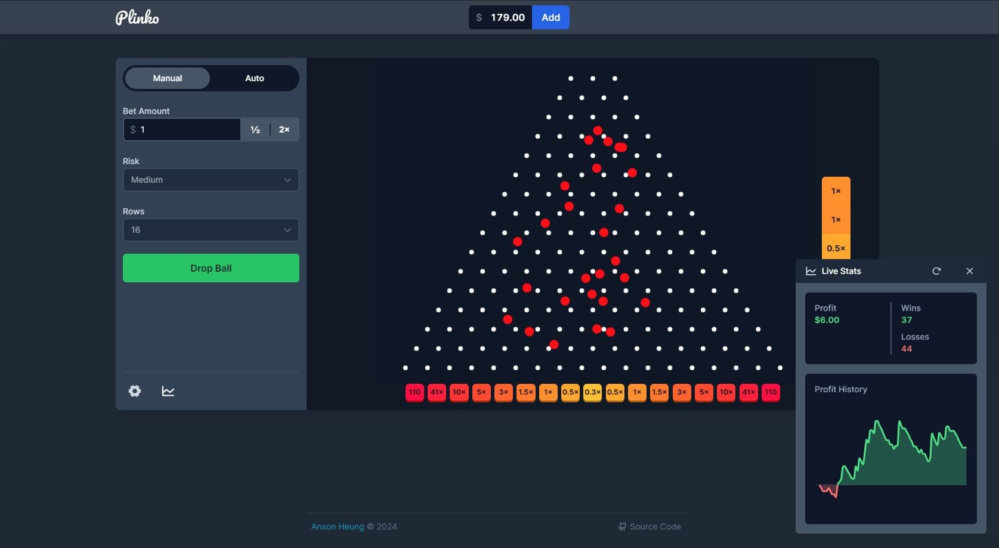
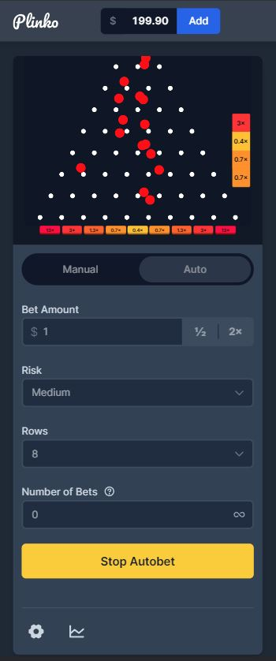

<div align="center">
  
  <h1>plinko-game</h1>
  <p>A web Plinko game inspired by Stake.com's Plinko game.</p>
  <p>Play now 👉 <a href="https://plinko-web-game.netlify.app/" target="_blank" rel="noreferrer">https://plinko-web-game.netlify.app/</a></p>
  
</div>

## About

Plinko is a classic game where the player drops a ball in a multi-row pin pyramid, where the ball bounces randomly until it reaches the payout bins at the bottom.

This project is a replication of [Stake.com's Plinko game](https://stake.com/casino/games/plinko), created using [Svelte](https://svelte.dev/), [Tailwind CSS](https://tailwindcss.com/), and [matter-js](https://github.com/liabru/matter-js). This website is a fun personal project to learn Svelte, and it is not affiliated with Stake.com in any way. I don't encourage gambling, so that's why I created a free-to-play version of the game.

## Features

- 🤑 100% free to play, add money at any time (~~not another crypto scam~~)
- 🤖 Manual and auto-bet modes
- 📊 Real-time live stats
- 📱 Responsive design

## Development

### Getting Started

> [!NOTE]
> Requires Node.js 20 or later.

1. Install [pnpm](https://pnpm.io/installation)
2. Clone this repository
3. Install dependencies

   ```bash
   pnpm install
   ```

4. Start the development server

   ```bash
   pnpm dev
   ```

### Building for Production

The entire site is statically generated using [@sveltejs/adapter-static](https://github.com/sveltejs/kit/tree/main/packages/adapter-static).

1. Generate a static build

   ```bash
   pnpm build
   ```

2. Preview the build site

   ```bash
   pnpm preview
   ```

### Testing

For unit tests, run:

```bash
pnpm test:unit
```

For end-to-end tests powered by [Playwright](https://playwright.dev/):

1. Build for production

   ```bash
   pnpm build
   ```

2. Run the tests

   ```bash
   # Run in UI mode (recommended when writing tests)
   pnpm test:e2e:ui

   # Alternatively, run in headless mode
   pnpm test:e2e
   ```

### Benchmark

A hidden page is only available in local dev environment to benchmark the payout probabilities and expected values. I used this page to tune the parameters of the matter-js physics engine and control the expected payout.

To visit this page, visit the below URL after starting the development server with `pnpm dev`:

```
http://localhost:5173/benchmark
```

## More Screenshots

Mobile:

| Manual Mode                             | Auto Mode                               |
| --------------------------------------- | --------------------------------------- |
|  |  |
